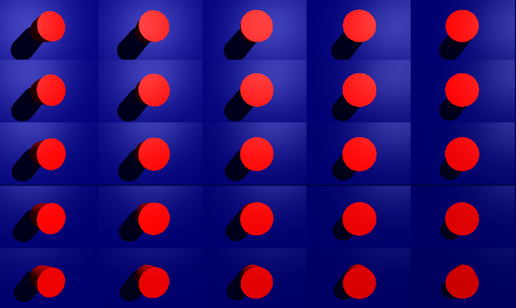

# 相机列表

可以在一个屏幕中使用多个相机

## 效果



## 关键代码

```js
for ( var y = 0; y < AMOUNT; y ++ ) {

					for ( var x = 0; x < AMOUNT; x ++ ) {

						var subcamera = new THREE.PerspectiveCamera( 40, ASPECT_RATIO, 0.1, 10 );
						subcamera.bounds = new THREE.Vector4( x / AMOUNT, y / AMOUNT, SIZE, SIZE );
						subcamera.position.x = ( x / AMOUNT ) - 0.5;
						subcamera.position.y = 0.5 - ( y / AMOUNT );
						subcamera.position.z = 1.5;
						subcamera.position.multiplyScalar( 2 );
						subcamera.lookAt( new THREE.Vector3() );
						subcamera.updateMatrixWorld();
						cameras.push( subcamera );

					}

				}

				camera = new THREE.ArrayCamera( cameras );
```