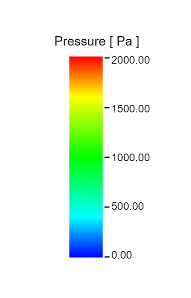

# 几何颜色

## 关键代码

这里用到一个色彩拾取库[Lut.js](https://threejs.org/docs/#examples/Lut),可以参考，效果如下：



## 其它

### 世界坐标旋转

```js
var rotWorldMatrix;

function rotateAroundWorldAxis ( object, axis, radians ) {

	if ( !axis ) return;

	rotWorldMatrix = new THREE.Matrix4 ();
	rotWorldMatrix.makeRotationAxis ( axis.normalize (), radians );
	rotWorldMatrix.multiply ( object.matrix );

	object.matrix = rotWorldMatrix;
	object.rotation.setFromRotationMatrix ( object.matrix );

}
```

### 加载模型后重新计算法向量

```js
loader.load ( "models/json/pressure.json", function ( geometry ) {

	// 什么情况下要重新计算法向量
	geometry.computeVertexNormals ();
	geometry.normalizeNormals ();

})
```