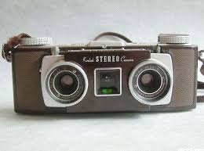

# 立体相机效果

立体相机模拟人的两个眼睛：



模拟人两只眼睛看到不同画面的效果

## 关键代码

1、引入
```html
<script src="js/effects/StereoEffect.js"></script>
```

2、创建效果
```js
effect = new THREE.StereoEffect( renderer );
				effect.setSize( window.innerWidth, window.innerHeight );
```

3、在渲染出使用下面语句渲染：
```js
effect.render( scene, camera );
```